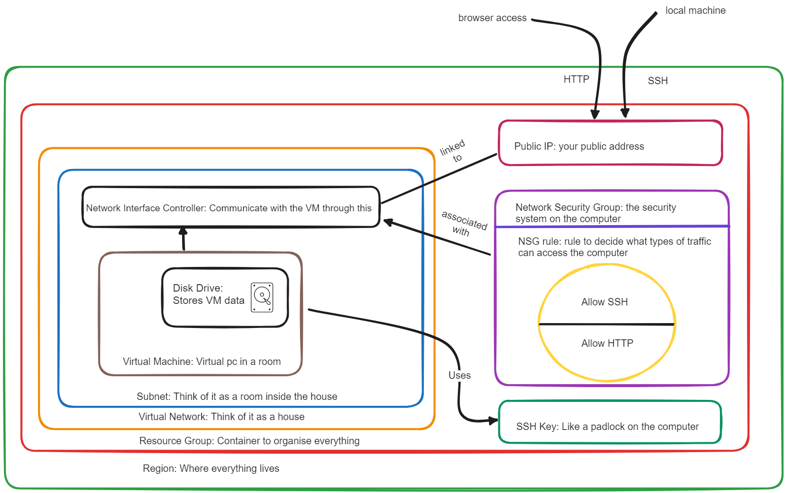

# Cloud

## What is cloud?

Services that are available on demand via the internet. Cloud data centers have water cooling and backup generators to ensure resilience. Data centers are often located at a minimum distance to mitigate the risk of natural disasters.

## Advantages of Using the Cloud:

- **Scalability:** Cloud services allow easy scaling of resources based on demand, avoiding overprovisioning or underutilization.
- **Cost efficiency:** Pay-as-you-go model eliminates upfront infrastructure investment, resulting in potential cost savings compared to on-premises infrastructure.
- **Accessibility:** Cloud services can be accessed from anywhere with an internet connection, enabling remote work and collaboration.
- **Reliability and disaster recovery:** Cloud providers have robust infrastructure and backup systems, ensuring high availability and data redundancy.
- **Automatic updates:** Cloud providers handle maintenance, security updates, and software upgrades, saving IT resources and ensuring access to the latest features.

## Disadvantages of Using the Cloud:

- **Dependency on internet connectivity:** Cloud services rely on internet connectivity, and network issues or outages can impact accessibility and productivity.
- **Data security and privacy concerns:** Storing data in the cloud requires trusting third-party providers and implementing robust security measures.
- **Limited control:** Organizations have less control over infrastructure, updates, and customization options in the cloud.
- **Potential vendor lock-in:** Transferring data and applications between cloud providers or on-premises infrastructure can be complex and time-consuming.

## Disadvantages of Hybrid Cloud or Multi-Cloud:

- **Complexity:** Managing multiple cloud environments and integrating them with on-premises infrastructure requires additional resources and expertise.
- **Cost and management overhead:** Maintaining multiple cloud accounts can lead to increased management overhead and potentially higher costs.
- **Data and application portability challenges:** Moving data and applications between different cloud providers or environments can be challenging.

## On-Premises vs. Cloud Cost Comparison:

- Cloud computing eliminates upfront hardware and infrastructure investment, reducing capital expenditure.
- Cloud services offer lower maintenance costs as the provider handles infrastructure maintenance and upgrades.
- Pay-as-you-go model allows cost optimization by paying only for resources used.
- On-premises infrastructure may be more cost-effective for predictable workloads or specific compliance requirements.

## Determining the "Best" Cloud Provider:

Choose a cloud provider based on organizational needs, considering service offerings, reliability, performance, pricing, customer support, and compatibility with existing tools and services.

## Management Groups:

Management groups help with access, compliance, and policy enforcement across multiple subscriptions. They enable setting specific resource quotas and permissions for different teams. Management groups can be nested to create a hierarchical structure for better organization and management.

## Subscription:

A separate payment account used to manage resources and billing. Each subscription receives a separate bill and can have different types, such as student subscriptions or pay-as-you-go. Quotas can be set for each subscription to limit the number of resource groups or resources.

## Resource Groups:

Containers for organizing and managing resources within a subscription. Resource groups cannot be nested within other resource groups. While Azure requires resource groups, they are not mandatory in AWS.

## Resources:

Resources are the individual components, such as virtual machines or storage accounts, that need to be managed within a resource group.

## CapEx vs. OpEx:

- **Capital expenditure (CapEx):** Refers to upfront costs associated with purchasing and maintaining physical hardware, often associated with on-premises infrastructure.
- **Operating expenses (OpEx):** Are ongoing expenses spread out over time, such as monthly or annual fees, commonly associated with cloud services.

## Tags:

Tags are key-value pairs used to label and categorize resources. They help in grouping and organizing resources for billing and management purposes.

## ARM (Azure Resource Manager):

ARM is an API and management layer for Azure resources. It allows CRUD operations (Create, Read, Update, Delete) on Azure resources. ARM controls the deployment and management of resources in the background.

## Virtual Network:

Virtual Network is a logical representation of a network infrastructure in the cloud. It provides a level of protection and security for resources. Subnets within a virtual network divide the network into smaller segments, similar to rooms in a house, and they cannot overlap.

## What is virtualization?

Virtualization is the process of creating virtual versions of physical resources, such as servers, storage devices, or networks. It allows multiple virtual instances to run on a single physical infrastructure, effectively maximizing resource utilization.

## What is a virtual machine?

A virtual machine (VM) is a software emulation of a physical computer that runs on a host machine. It has its own operating system and behaves like an independent machine, capable of running applications and executing tasks.

## Where can virtual machines be run?

Virtual machines can be run on various types of physical infrastructure, including:

- On-premises data centers: Organizations can set up their own virtualization infrastructure using dedicated servers and virtualization software.
- Cloud platforms: Cloud service providers offer virtual machines as part of their services, enabling users to run VMs on their infrastructure.

## What determines how many virtual machines can run?

The number of virtual machines that can run depends on several factors, including:

- Physical hardware capacity: The resources available on the host machine, such as CPU, memory, and storage, determine how many VMs can be supported.
- Resource allocation: The allocation of resources to each virtual machine affects the total number of VMs that can run concurrently.
- Workload requirements: The resource demands of the applications running within the VMs impact the number of VMs that can effectively operate on a given infrastructure.

## What does a virtual machine include?

A virtual machine includes several components:

- Virtual hardware: Emulated components, such as virtual CPU, memory, disk storage, and network interfaces.
- Operating system: Each virtual machine runs its own operating system, such as Windows or Linux.
- Applications: Virtual machines can host applications, just like physical machines.
- Configuration settings: Virtual machines have specific settings, such as network configurations, disk allocation, and security parameters.

## What software is required to orchestrate/run the virtual machines?

Virtualization software, also known as a hypervisor, is required to orchestrate and run virtual machines. Examples include:

- Microsoft Hyper-V
- KVM (Kernel-based Virtual Machine)
- Oracle VM VirtualBox

## What is the importance of an image when creating a VM?

An image is a template or snapshot of a pre-configured virtual machine. When creating a VM, the image serves as a blueprint, containing the operating system, applications, and configurations required for the virtual machine. Using images allows for quick and consistent deployment of virtual machines, ensuring that each instance starts from a known and standardized state. Images also enable the efficient scaling of VMs, as multiple instances can be created from the same base image.

## Sign in to the Azure portal:

Go to the Azure portal website and sign in with your Azure account.

## Create a new resource group:

Resource groups help you organize and manage your Azure resources.

1. Click on "Resource groups" in the left-hand menu.
2. Click the "Add" button to create a new resource group.
3. Provide a name, select the subscription, and choose a region for the resource group.

## Create a new virtual machine:

In the Azure portal, click on "Virtual machines" in the left-hand menu. Click the "Add" button to create a new virtual machine.

## Choose a base image:

Azure provides a variety of pre-configured images for virtual machines. Select the desired operating system and version from the available options. (e.g., Windows Server, Ubuntu, CentOS)

## Configure virtual machine settings:

Provide a name for the virtual machine. Select the subscription and choose the resource group created in step 2. Select the appropriate region and availability options based on your requirements.

## Choose a size:

Select the appropriate size for your virtual machine based on the compute resources you need. Azure offers a range of options with varying CPU, memory, and disk configurations. Use the pricing calculator to estimate costs if needed.

## Configure networking:

Specify the virtual network and subnet for deploying the virtual machine. Create a new virtual network or use an existing one. Configure other networking settings such as public IP address and network security groups.

## Set up storage:

Configure the storage options for your virtual machine. Choose between Azure Managed Disks or an existing storage account. Specify the disk type, size, and other storage-related settings.

## Configure advanced options:

Azure provides additional advanced options such as extensions, monitoring, and diagnostics. Enable these features if needed or skip them for now.

## Review and create:

Review all the settings configured for the virtual machine. Once satisfied, click on the "Create" button to start the deployment process.

## Wait for deployment:

Azure will start deploying the virtual machine based on the provided configuration. The deployment process may take a few minutes to complete.

## Access and manage your virtual machine:

After the deployment is finished, you can access and manage your virtual machine through the Azure portal. Connect to the virtual machine using SSH. Perform any necessary configurations.



# blob storage

resource group -> storage account -> container(s) -> blobs

- redundancies: not essential for a program to run - backup copies of things incase of a disaster, you can fall back on it.

# Azure Blob Storage

## A. What is it?

Azure Blob Storage is a service for storing large amounts of unstructured object data, such as images, documents, video etc.

## B. Difference between Blob Storage and Hierarchical File Storage

Blob Storage is an object storage system which treats files as blobs or 'Binary Large Objects'. It doesn't maintain a hierarchy or directory structure like traditional file systems in Linux/Windows/Mac. Each blob is stored in a flat namespace within a storage account and identified by a unique name.

## C. Advantages/Disadvantages of Blob Storage

Advantages:

- **Scalability**: Blob storage can handle large amounts of data.
- **Accessibility**: Data in blob storage is accessible from anywhere in the world via HTTP or HTTPS.
- **Security**: Azure provides strong security measures to protect your data.

Disadvantages:

- **Cost**: Depending on the amount of data and access frequency, costs can be high.
- **Complexity**: It can be more complex to manage and organize data due to the lack of a hierarchical structure.

## D. Different Tiers and Cost

- **Hot tier**: For data that is accessed frequently.
- **Cool tier**: For data that is infrequently accessed and stored for at least 30 days.
- **Archive tier**: For data that is rarely accessed and stored for at least 180 days.

## E. Parts of Azure Blob Storage

- **Account**: The Azure account under which the blob storage is created.
- **Container**: A container provides a grouping of a set of blobs. All blobs must be in a container.
- **Blobs**: A blob is a file of any type and size.

The relationship is as follows: An account can contain multiple containers, and a container can hold multiple blobs.

# Azure Block Blob Storage Redundancy Types

Azure's block blob storage offers several types of data redundancy to ensure durability and high availability. Here are the different types:

## 1. Locally Redundant Storage (LRS)

LRS provides at least 99.999999999% (11 9's) durability of objects over a given year. With LRS, data is replicated within a single data center in a single region.

## 2. Zone-Redundant Storage (ZRS)

ZRS provides the same durability percentage as LRS. However, data is replicated synchronously across three Azure availability zones in the same region.

## 3. Geo-Redundant Storage (GRS)

GRS provides 99.99999999999999% (16 9's) durability and includes the replication of data to a secondary region that is hundreds of miles away from the primary region.

## 4. Read-Access Geo-Redundant Storage (RA-GRS)

RA-GRS provides the same durability as GRS. In addition, it allows for read access to data in the secondary region, providing higher availability.

## 5. Geo-Zone-Redundant Storage (GZRS)

GZRS combines the features of GRS and ZRS by providing replication across availability zones and to a secondary region.

## 6. Read-Access Geo-Zone-Redundant Storage (RA-GZRS)

RA-GZRS is similar to GZRS but also provides read access in the secondary region, offering the highest availability.

Each redundancy option is designed to meet different needs and comes with its own cost implications. It's important to understand these differences when choosing the right redundancy for your application.

# Creating a blob

## 0. AZ Login

```
az login
```

then you put in your account credentials, if correct you should get this image


and this should appear in your terminal


## 1. Create a storage account

```

az storage account create --name tech241zainstorage --resource-group tech241 --location uksouth --sku Standard_LRS

```


## 2. List all storage accounts in a resource group

```

az storage account list --resource-group tech241

```

## 3. List all storage accounts in a resource group with specific attributes

```

az storage account list --resource-group tech241 --query "[].{Name:name, Location:location, Kind:kind}" --output table

```


## 4. Create a container

```

az storage container create --account-name tech241zainstorage --name testcontainer

```

## 5. Upload a blob

```

az storage blob upload --account-name tech241zainstorage --container-name testcontainer --name newname.txt --file test.txt --auth-mode login

```

## 6. List all blobs in a container

```

az storage blob list --account-name tech241zainstorage --container-name testcontainer --output table --auth-mode login

```
